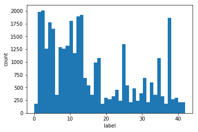
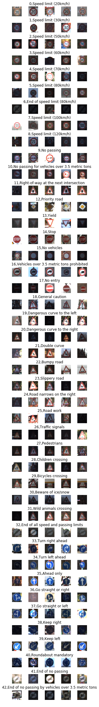
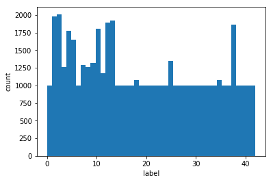
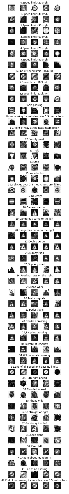
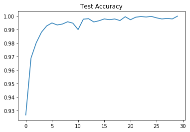
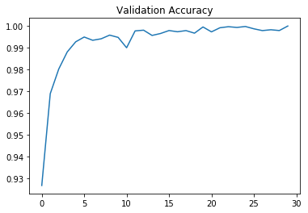
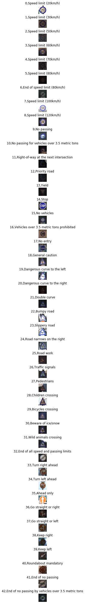

#**Traffic Sign Recognition** 

##Writeup Template

###You can use this file as a template for your writeup if you want to submit it as a markdown file, but feel free to use some other method and submit a pdf if you prefer.

---

**Build a Traffic Sign Recognition Project**

The goals / steps of this project are the following:
* Load the data set (see below for links to the project data set)
* Explore, summarize and visualize the data set
* Design, train and test a model architecture
* Use the model to make predictions on new images
* Analyze the softmax probabilities of the new images
* Summarize the results with a written report

[//]: # (Image References)

[image1]: ./examples/visualization.jpg "Visualization"
[image2]: ./examples/grayscale.jpg "Grayscaling"
[image3]: ./examples/random_noise.jpg "Random Noise"
[image4]: ./examples/placeholder.png "Traffic Sign 1"
[image5]: ./examples/placeholder.png "Traffic Sign 2"
[image6]: ./examples/placeholder.png "Traffic Sign 3"
[image7]: ./examples/placeholder.png "Traffic Sign 4"
[image8]: ./examples/placeholder.png "Traffic Sign 5"

## Rubric Points
###Here I will consider the [rubric points](https://review.udacity.com/#!/rubrics/481/view) individually and describe how I addressed each point in my implementation.  

---
###Writeup / README

####1. Provide a Writeup / README that includes all the rubric points and how you addressed each one. You can submit your writeup as markdown or pdf. You can use this template as a guide for writing the report. The submission includes the project code.

You're reading it! and here is a link to my [project code](https://github.com/udacity/CarND-Traffic-Sign-Classifier-Project/blob/master/Traffic_Sign_Classifier.ipynb)

###Data Set Summary & Exploration

####1. Provide a basic summary of the data set. In the code, the analysis should be done using python, numpy and/or pandas methods rather than hardcoding results manually.

I used the pandas library to calculate summary statistics of the traffic
signs data set:

* The size of training set is 34799
* The size of test set is 12630
* The shape of a traffic sign image is (32, 32, 3)
* The number of unique classes/labels in the data set is 43

####2. Include an exploratory visualization of the dataset.

Here is an exploratory visualization of the data set. It is a bar chart showing how the data ...

###Design and Test a Model Architecture

####1. Describe how you preprocessed the image data. What techniques were chosen and why did you choose these techniques? Consider including images showing the output of each preprocessing technique. Pre-processing refers to techniques such as converting to grayscale, normalization, etc. (OPTIONAL: As described in the "Stand Out Suggestions" part of the rubric, if you generated additional data for training, describe why you decided to generate additional data, how you generated the data, and provide example images of the additional data. Then describe the characteristics of the augmented training set like number of images in the set, number of images for each class, etc.)

As a first step, I decided to convert the images to grayscale because ...

Here is an example of a traffic sign image before and after grayscaling.

I decided to generate additional data because some train data count was lower than 1000
to avoid unbalanced training. 
The following is result counts.

To add more data to the the data set, I used the following techniques
* random_brightness: Adjust brightness of image by random factor.Learned from [link](https://www.tensorflow.org/api_docs/python/tf/image/random_brightness)
* random_contrast: Adjust image contrast by random factor.Learned from [link](https://www.tensorflow.org/api_docs/python/tf/image/random_contrast)
* per_image_whitening: Subtract off the mean and divide by the variance of the pixels.Learned from [link](https://www.tensorflow.org/api_docs/python/tf/image/per_image_standardization)
* Converting to gray scale to resolve various colors.

Here is an example of an original image and an augmented image:

####2. Describe what your final model architecture looks like including model type, layers, layer sizes, connectivity, etc.) Consider including a diagram and/or table describing the final model.

My final model consisted of the following layers:

| Layer         		|     Description	        					|
|:---------------------:|:---------------------------------------------:|
| Input         		| 32x32x1 grayscale image   							|
| Convolution 5x5     	| 2x2 stride, valid padding, outputs 28x28x6 	|
| RELU					|												|
| Max pooling	      	| 2x2 stride,  outputs 14x14x6 				|
| Convolution 5x5	    | 2x2 stride, valid padding, outputs 10x10x16    |
| RELU					|												|
| Max pooling	      	| 2x2 stride,  outputs 5x5x16 				|
| Fully connected		| input 400, output 120        									|
| RELU					|												|
| Dropout				| 50% keep        									|
| Fully connected		| input 120, output 84        									|
| RELU					|												|
| Dropout				| 50% keep        									|
| Fully connected		| input 84, output 43        									|
 

####3. Describe how you trained your model. The discussion can include the type of optimizer, the batch size, number of epochs and any hyperparameters such as learning rate.

To train the model, I used an LeNet for the most part that was given,but I did an additional dropout before last Fully connected layer.
Batch size is 128 and learning rate is 0.001,this is from udacity lesson(no change).
Epoch is 30. It was decided from iteration of this projects. 

####4. Describe the approach taken for finding a solution and getting the validation set accuracy to be at least 0.93. Include in the discussion the results on the training, validation and test sets and where in the code these were calculated. Your approach may have been an iterative process, in which case, outline the steps you took to get to the final solution and why you chose those steps. Perhaps your solution involved an already well known implementation or architecture. In this case, discuss why you think the architecture is suitable for the current problem.

My final model results were:
* training set accuracy of 0.999
* validation set accuracy of 0.943
* test set accuracy of 0.921

If an iterative approach was chosen:
* What was the first architecture that was tried and why was it chosen?
  *  I used a very similar architecture to the paper offered by the instructors.  I used it because they got such a good score the answer was given.
* What were some problems with the initial architecture?
  * The first issue is lack of training data, so I made up training data from same source to labels lower than 1000 count. 
  * The second issue is gray scaling. Some signs were various background color(red and blue etc...), so I decided to apply gray scaling to train figure without color information.
* How was the architecture adjusted and why was it adjusted? Typical adjustments could include choosing a different model architecture, adding or taking away layers (pooling, dropout, convolution, etc), using an activation function or changing the activation function. One common justification for adjusting an architecture would be due to overfitting or underfitting. A high accuracy on the training set but low accuracy on the validation set indicates over fitting; a low accuracy on both sets indicates under fitting.
  * The validation accuracy was converged along with the test accuracy. 
  

    
* Which parameters were tuned? How were they adjusted and why?
  * Epoch and drop out probability were all tuned .
* What are some of the important design choices and why were they chosen? For example, why might a convolution layer work well with this problem? How might a dropout layer help with creating a successful model?
  *  I think the most important thing was data augmentation. When I used the default training dataset,some class were frequently misrecognized.But where I enhanced data to balancing class,then it was improved. 

###Test a Model on New Images

####1. Choose five German traffic signs found on the web and provide them in the report. For each image, discuss what quality or qualities might be difficult to classify.

Here are five German traffic signs that I found on the web:

####2. Discuss the model's predictions on these new traffic signs and compare the results to predicting on the test set. At a minimum, discuss what the predictions were, the accuracy on these new predictions, and compare the accuracy to the accuracy on the test set (OPTIONAL: Discuss the results in more detail as described in the "Stand Out Suggestions" part of the rubric).

This is displayed in answer 1.

####3. Describe how certain the model is when predicting on each of the five new images by looking at the softmax probabilities for each prediction. Provide the top 5 softmax probabilities for each image along with the sign type of each probability. (OPTIONAL: as described in the "Stand Out Suggestions" part of the rubric, visualizations can also be provided such as bar charts)

This is displayed in answer 1.

### (Optional) Visualizing the Neural Network (See Step 4 of the Ipython notebook for more details)
####1. Discuss the visual output of your trained network's feature maps. What characteristics did the neural network use to make classifications?

